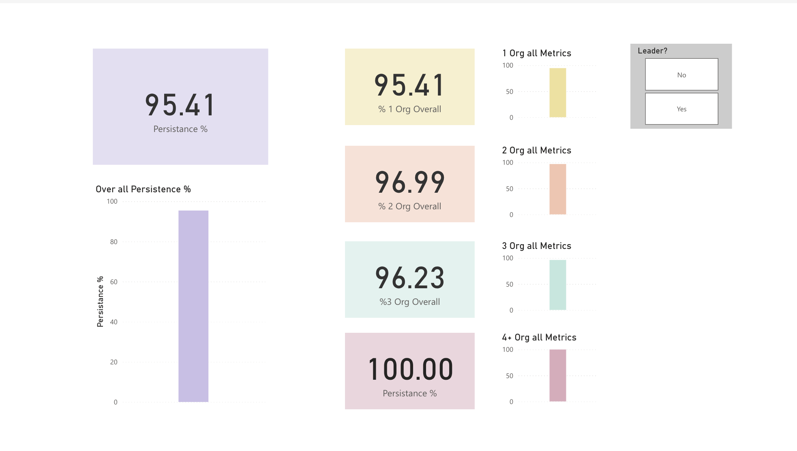

# 📊 University Retention & Enrollment Dashboard

A Power BI dashboard designed to analyze and visualize student retention and enrollment trends across university organizations and student demographics. Built for internal institutional research and leadership decision-making.

---

## 🌟 Features

- **KPI Overview**: Displays overall persistence and GPA metrics  
- **Organizational Analysis**: Breaks down persistence by student organizations  
- **Role-Based Metrics**: Compares metrics between student leaders and non-leaders  
- **Class-Level Analysis**: GPA comparison by student class level  
- **Filters & Slicers**: Dynamic filtering by headcount, organization, leader status, and more

---

## 🔐 Data Privacy

This report was developed using institutional student data under FERPA compliance. Due to privacy regulations, the underlying dataset and `.pbix` file are not publicly available.

All screenshots and metrics have been reviewed to ensure anonymization and ethical presentation.

---

## 🛠 Technologies Used

- Power BI (Desktop + Service)  
- Power Query (for data cleaning and transformation)  
- Excel (as original data source)  
- DAX (for calculated metrics and KPIs)

---

## 📸 Dashboard Pages & Previews

### 1️⃣ Persistence by Organization  
Displays retention rates by student organization, with slicers for headcount and organization filtering.  

---

### 2️⃣ All Metrics Overall  
A high-level overview of persistence metrics across all groups, categorized by number of organizations and leadership involvement.  

---

### 3️⃣ Student Class Metrics  
GPA analysis based on academic standing — from Freshman to Post-Baccalaureate.  

---

### 4️⃣ Persistence % by Number of Organizations  
Visualizes how student engagement (via number of organizations joined) affects persistence rates.  

---

### 5️⃣ Persistence % by Number of Leaders  
Breaks down persistence by student leadership involvement across multiple organization tiers.  

---

## 📈 Insight Summary: Retention & Engagement Patterns

During the analysis of student involvement and persistence data, several key patterns emerged that suggest strong correlations between co-curricular engagement and student retention outcomes:

### 🔹 1. Multi-Organization Involvement = Perfect Persistence  
Students involved in **4 or more student organizations** had a **100% persistence rate**, compared to the overall rate of **95.41%**. This suggests that deeper engagement across campus correlates with stronger commitment and retention.

**Recommendation**: Promote multi-org involvement—especially to underclassmen and first-year students—to improve long-term persistence rates.

### 🔹 2. Student Leaders Persist at Higher Rates  
Students identified as **leaders** within organizations showed a **99.09% persistence rate**, outperforming **non-leaders** (93.96%). This performance gap of **5.13%** highlights leadership’s potential role in boosting retention.

**Recommendation**: Expand leadership training opportunities and early leadership exposure—especially for students in at-risk groups.

### 🔹 3. Engagement Matters More Than GPA  
While the **average GPA across all cohorts was 3.38**, GPA did not correlate with retention as strongly as **organizational involvement** or **leadership roles**. Students with lower GPAs but multiple org memberships still showed high persistence.

**Recommendation**: Shift part of the retention focus from purely academic interventions to structured engagement programs and student org onboarding.

---

## 🧭 How to Use This Dashboard

These insights can help university leadership:

- Launch early engagement campaigns targeting low-involvement student groups  
- Allocate more resources toward student leader mentoring and leadership pipeline programs  
- Support policy shifts that integrate co-curricular involvement into student success strategies

## 📁 Repository Structure

| File/Folder              | Description                              |
|--------------------------|------------------------------------------|
| `screenshots/`           | Contains anonymized images from the report |
| `README.md`              | This documentation file                  |

---

## 📎 Project Context

This report supported institutional leadership in identifying retention patterns across student groups, enabling data-driven decisions on program development and student support initiatives.

---

## 👤 Author

**Moses Koroma**  
[Portfolio Website](https://moseskoroma.me) • [GitHub](https://github.com/mokeyzz1) • [LinkedIn](https://linkedin.com/in/mosesbkoroma)
